# DartMoQP: A MoE-Native Unified Framework for Mixed-Precision Quantization &amp; Structured Pruning

DartMoQP is a Mixture-of-Experts-native unified quantization and structured pruning framework. It brings quantization and pruning into a single mathematical framework for joint sensitivity modeling and global optimal search, with neuron-level expert reordering.

## Key Contributions

### Challenges Addressed

1. **Different quantization algorithms have fundamentally different error geometry characteristics**
2. **Quantization and pruning have inconsistent optimization objectives**

### Key Insights from Large-Scale Experiments

1. **Sensitivity Metric Design**:
   - For per-row quantization algorithms like GPTQ: Quantization error already incorporates second-order Hessian weighting from the input calibration set during iteration, so using element-wise MSE directly yields good sensitivity
   - For vector quantization algorithms like TurboQuant: Global random rotation causes energy homogenization, making element-wise MSE sensitivity poorly differentiated; an inner product loss based on the calibration input manifold is more suitable

2. **Unified Loss Space**:
   - For major quantization algorithms (GPTQ and TurboQuant), quantization loss follows a perfect quadratic distribution in the log domain
   - This allows reliable extrapolation of 0bit loss without any manual hyperparameters
   - Enables unified loss modeling of quantization and pruning for the first time

3. **Unified Dynamic Programming Search**:
   - A group-wise dynamic programming approach for optimal bit allocation
   - First, compute and cache quantization loss for each neuron at multiple bit widths (1-4 bits), then extrapolate 0bit loss (pruning) via log-quadratic fitting
   - Neurons within each expert are sorted by sensitivity, split into S groups, and all sub-experts are globally ranked by importance (sensitivity × expert activation rate)
   - Finally, monotonic DP search with non-increasing bit allocation constraint finds the optimal bit assignment at target bpw

4. **Stability to Random Seed**:
   - The random rotation matrix in TurboQuant causes different models to have varying sensitivity to different random seeds, leading to different quantization errors across models
   - This phenomenon is related to the weight characteristics of different models, resulting in different behaviors across models
   - Experiments show that our method can stabilize the impact of random seeds on quantization error

### Framework Design

DartMoQP adopts a quantization-method-agnostic global dynamic programming search pipeline that automatically matches the optimal sensitivity metric and bit allocation scheme for any quantization algorithm.


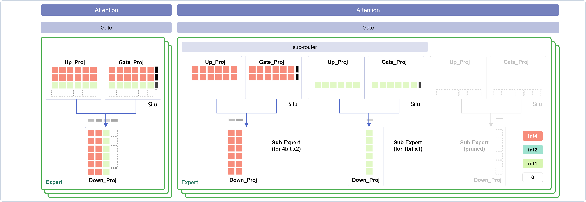

## Neuron-Level Expert Reordering

DartMoQP performs neuron-level expert reordering to optimize for mixed-precision quantization. The process is as follows:

[PLACEHOLDER FOR METHOD FIGURE - To be added later]

1. **Sensitivity Calculation**: For each neuron in each expert, compute its quantization sensitivity using the appropriate metric for the quantization algorithm (element-wise MSE for GPTQ, inner product loss for TurboQuant)
2. **Neuron Ranking**: Neurons within each expert are sorted in descending order of sensitivity (most sensitive first)
3. **Sub-expert Formation**: Sorted neurons are divided into S slices/sub-experts
4. **Global Merging in Hybrid Mode**: When using hybrid MoE, sub-experts can be dynamically merged based on their importance during inference

This reordering ensures that the most error-sensitive neurons receive more bits while less important neurons can be safely pruned (0bit) or quantized to lower precision.

## Hybrid MoE Wrapper Implementation

DartMoQP uses a wrapper-based approach that is compatible with all Transformers library-based models. The hybrid MoE structure features:

1. **Two-level Gating Mechanism**:
   - **First level**: Original MoE routing (same as the base model)
   - **Second level**: Mixed-precision selector that chooses sub-experts based on their assigned bit width

2. **Expert Merging**:
   - Sub-experts with the same bit width can be merged for efficient inference
   - Maintains compatibility with the original model architecture through wrapper composition

3. **Backward Compatibility**:
   - The wrapper preserves all original model interfaces
   - Works seamlessly with HuggingFace `generate()` and evaluation pipelines
   - Can be disabled with `--no-use-hybrid-moe` to use original experts


**Note on Implementation**: 

The current implementation is a simulated quantization framework. All quantized operations are dequantized back to fp16 for actual inference. While this does not provide real inference speedup, it enables accurate evaluation of quantization error and can guide the design of practical quantization algorithms.

## Loss Caching Mechanism

To avoid redundant computation during parameter sweeps, DartMoQP implements a loss caching mechanism:

1. **Cache Location**: Cached losses are stored in `intermediate_result/quant_outlier_{gptq,turboquant}/{rank_mode}/{model_id}/`
2. **Activation Cache**: Expert activation rates are stored in `intermediate_result/expert_activate/{model_id}/`
3. **Cache Format**: Separate cache files for each bit width: `{model_id}_L{layer_idx}_b{bit}.pt`; activation-rate files use `{model_id}_L{layer_idx}.pt`
4. **Contents**: Each quant cache file contains per-neuron quantization loss for all experts in that layer
5. **Reuse**: The cache is automatically reused for different rank modes, quant schemes, and seed values
6. **Groupsize**: All cache computations use a consistent groupsize of 128

This caching significantly speeds up hyperparameter searches and ablation studies.

## Results

DartMoQP achieves state-of-the-art performance across the full 0.5-4.0 bpw range on multiple mainstream MoE models:
- OLMoE-1B-7B (7B-A1B)
- DeepSeekMoE-v1 (16B-A3B)
- DeepSeekMoE-v2 (16B-A3B)
- Moonlight (16B-A3B)
- Qwen3-30B-A3B

### Method Combinations

- **GPTQ-based methods**: Use GPTQ loss + dynamic programming (DP) + GPTQ quantization
- **Energy-based method**: Uses energy importance (from CAMERA) + DP + TurboQuant quantization. Note: Energy method does not support 0bit loss extrapolation, so it cannot be used for schemes below 1bit. At 1bit, it degrades to a non-optimized baseline.
- **Other TurboQuant-based methods**: Use TurboQuant loss + dynamic programming (DP) + TurboQuant quantization

Notably:
- **Extremely low bit regime (0.5-2 bpw)**: Order-of-magnitude performance improvement over baselines (though still not fully practical)
- **2bit scheme (industry standard)**: DartMoQP-TurboQuant consistently outperforms existing methods in downstream tasks

### ppl (c4 only, wiki-text2 is not shown here)
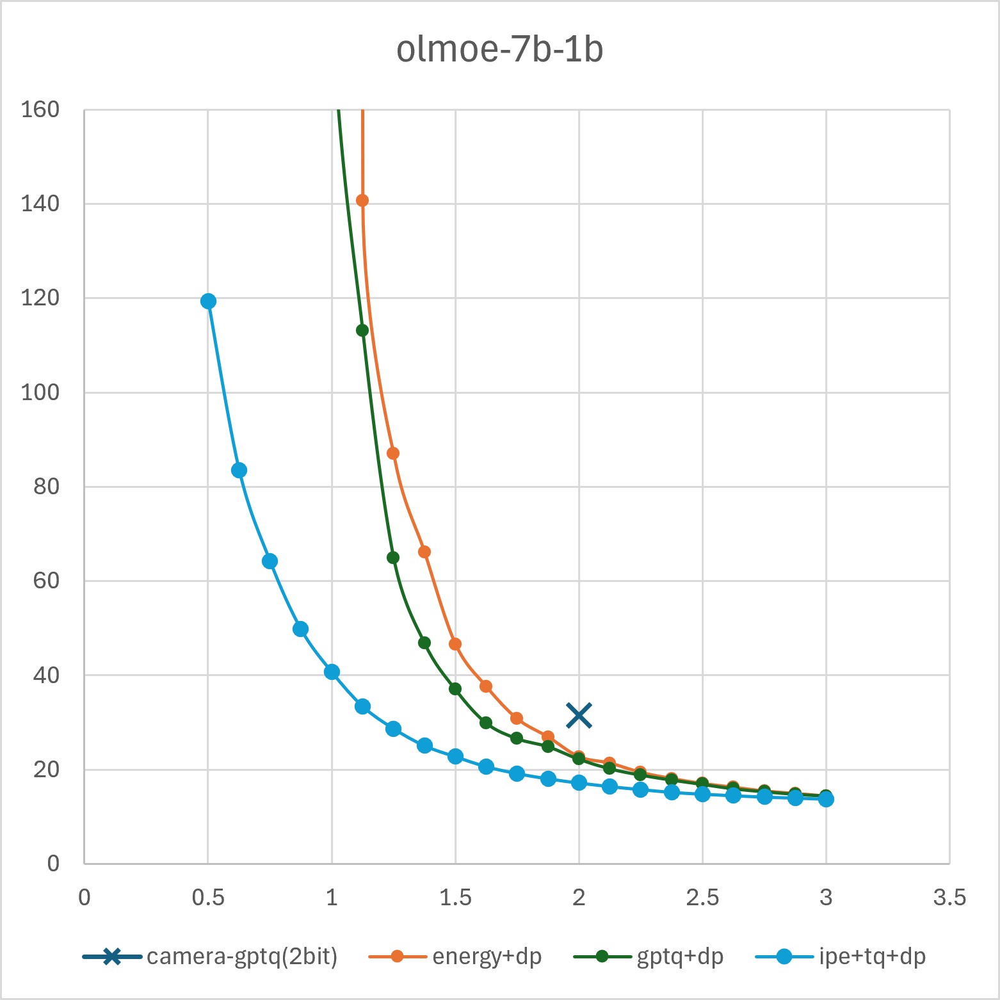
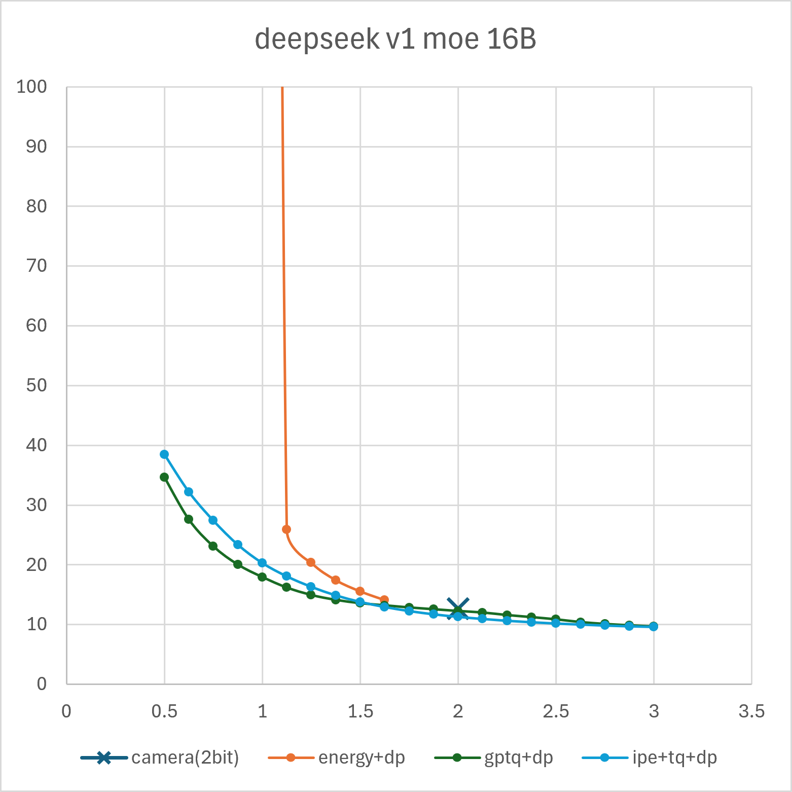
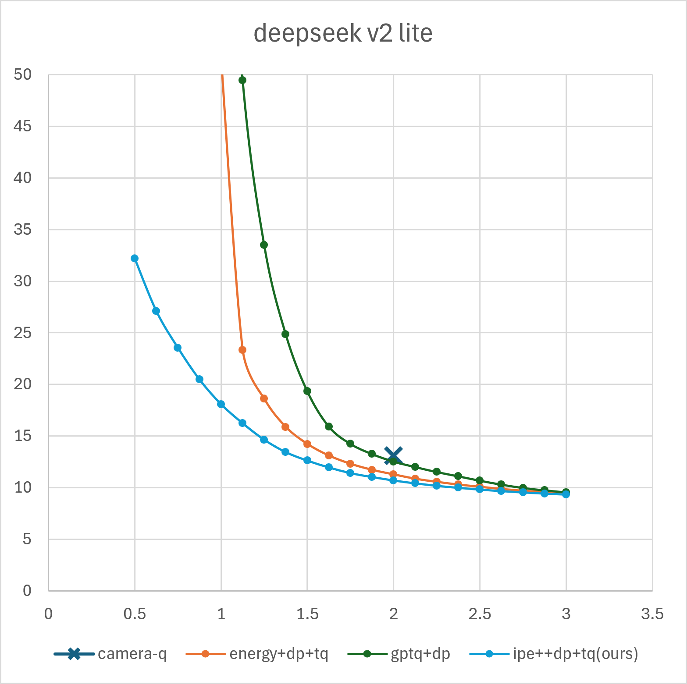
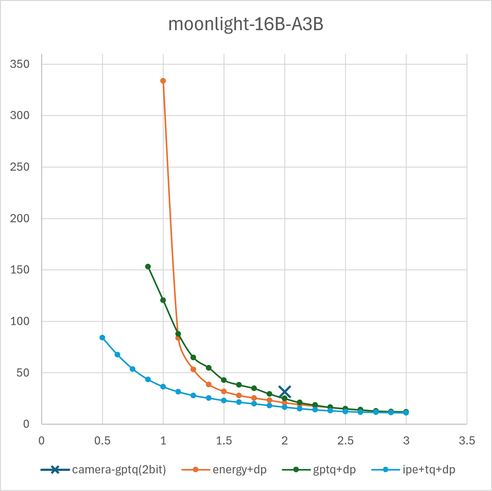
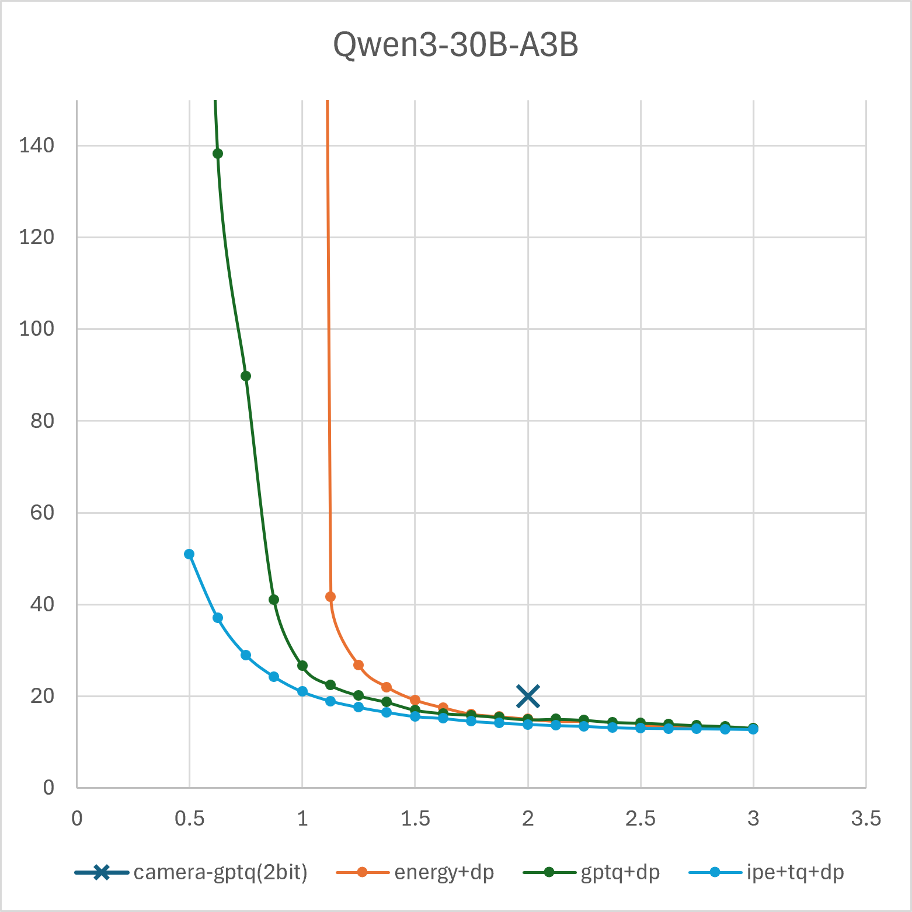

The figures above show perplexity vs. bits-per-weight (bpw) comparisons between DartMoQP and representative quantization methods across five MoE models. DartMoQP-TurboQuant consistently achieves the lowest perplexity across all bit widths.

### eval-zero tasks

IPE-TQ means inner product encoding with TurboQuant quantization.

#### 1.0 bpw (+0.25) (Origin scheme: a8s8m1, DP scheme: global-bpw-a8s8m1)

| Model | Method | WikiText2 | C4 | Avg. | ARC-C(norm) | ARC-E(norm) | PIQA(norm) | BoolQ | Winogrande | MNLI | Hella(norm) | MMLU |
|-------|--------|-----------|----|-------|----------|---------------|------|-------|------------|-----------|------|-------|
| DSMoEv1 | Energy-DP | 278.704 | 573.556 | 0.347 | 0.245 | 0.256 | 0.519 | 0.379 | 0.506 | 0.363 | 0.271 | 0.235 |
| DSMoEv1 | GPTQ-Origin | 132.710 | 566.143 | - | 0.261 | 0.257 | 0.503 | 0.378 | 0.526 | 0.354 | 0.257 | **0.269** |
| DSMoEv1 | GPTQ-DP | 10.878 | **18.561** | **0.523** | **0.375** | **0.650** | **0.693** | 0.629 | **0.622** | **0.400** | **0.552** | 0.266 |
| DSMoEv1 | TQ-Origin | 663.677 | 723.955 | 0.350 | 0.246 | 0.266 | 0.517 | 0.378 | 0.531 | 0.355 | 0.258 | 0.250 |
| DSMoEv1 | IPE-TQ-DP | **9.962** | 20.576 | 0.521 | 0.374 | 0.677 | 0.661 | **0.691** | 0.617 | **0.400** | 0.497 | 0.253 |
||
| DSv2-Lite | Energy-DP | 37.792 | 51.508 | 0.384 | 0.230 | 0.316 | 0.550 | 0.572 | 0.504 | 0.336 | 0.307 | 0.260 |
| DSv2-Lite | GPTQ-Origin | 142.748 | 210.266 | 0.373 | 0.235 | 0.273 | 0.514 | 0.594 | 0.519 | 0.328 | 0.270 | 0.249 |
| DSv2-Lite | GPTQ-DP | 59.076 | 100.628 | 0.360 | 0.240 | 0.272 | 0.503 | 0.540 | 0.508 | 0.317 | 0.265 | 0.235 |
| DSv2-Lite | TQ-Origin | 35.779 | 49.428 | 0.386 | 0.220 | 0.341 | 0.554 | 0.570 | 0.486 | **0.347** | 0.316 | 0.252 |
| DSv2-Lite | IPE-TQ-DP | **8.833** | **18.258** | **0.524** | **0.369** | **0.670** | **0.671** | 0.489 | **0.579** | 0.388 | **0.502** | 0.358 |
||
| Moonlight | Energy-DP | 249.477 | 333.547 | 0.384 | 0.218 | 0.340 | 0.552 | 0.556 | 0.501 | 0.354 | 0.296 | 0.254 |
| Moonlight | GPTQ-Origin | 354.383 | 569.412 | 0.363 | 0.238 | 0.308 | 0.532 | 0.453 | 0.499 | 0.344 | 0.282 | 0.251 |
| Moonlight | GPTQ-DP | 57.326 | 132.215 | 0.385 | 0.224 | 0.333 | 0.548 | 0.546 | 0.497 | **0.360** | 0.314 | 0.255 |
| Moonlight | TQ-Origin | 222.648 | 260.441 | 0.383 | 0.225 | 0.327 | 0.549 | 0.556 | 0.500 | 0.348 | 0.300 | 0.261 |
| Moonlight | IPE-TQ-DP | **14.871** | **36.872** | **0.480** | **0.325** | **0.608** | **0.634** | **0.638** | **0.550** | 0.335 | **0.452** | **0.296** |
||
| OLMoE | Energy-DP | 16753.113 | 8156.675 | 0.374 | 0.264 | 0.292 | 0.521 | 0.565 | 0.504 | 0.319 | 0.262 | 0.263 |
| OLMoE | GPTQ-Origin | 33766.746 | 18911.664 | 0.355 | 0.250 | 0.274 | 0.516 | 0.467 | 0.496 | 0.321 | 0.263 | 0.251 |
| OLMoE | GPTQ-DP | 162.274 | 302.431 | 0.385 | 0.216 | 0.335 | 0.536 | 0.590 | 0.523 | **0.348** | 0.298 | 0.236 |
| OLMoE | TQ-Origin | 16508.109 | 8896.238 | 0.365 | 0.249 | 0.282 | 0.522 | 0.538 | 0.506 | 0.321 | 0.260 | 0.243 |
| OLMoE | IPE-TQ-DP | **22.588** | **42.137** | **0.478** | **0.341** | **0.567** | **0.631** | **0.617** | **0.580** | 0.373 | **0.427** | **0.285** |
||
| Qwen3 | Energy-DP | 1886.718 | 1422.791 | 0.355 | 0.230 | 0.303 | 0.527 | 0.417 | 0.513 | 0.336 | 0.268 | 0.243 |
| Qwen3 | GPTQ-Origin | 4221.860 | 4872.952 | 0.350 | 0.261 | 0.257 | 0.503 | 0.378 | 0.526 | 0.354 | 0.257 | 0.269 |
| Qwen3 | GPTQ-DP | 982.384 | 1798.248 | 0.360 | 0.239 | 0.276 | 0.527 | 0.444 | 0.538 | 0.339 | 0.278 | 0.236 |
| Qwen3 | TQ-Origin | 1514.075 | 1284.209 | 0.359 | 0.246 | 0.283 | 0.516 | 0.455 | 0.500 | 0.335 | 0.284 | 0.252 |
| Qwen3 | IPE-TQ-DP | **28.18** | **48.203** | **0.539** | **0.385** | **0.659** | **0.637** | **0.712** | **0.568** | **0.496** | **0.422** | **0.432** |

#### 1.5 bpw (+0.25) (DP scheme: global-bpw-a8s8m1.5)

| Model | Method | WikiText2 | C4 | Avg. | ARC-C(norm) | ARC-E(norm) | PIQA(norm) | BoolQ | Winogrande | MNLI | Hella(norm) | MMLU |
|-------|--------|-----------|----|-------|----------|---------------|------|-------|------------|-----------|------|-------|
| DSMoEv1 | Energy-DP | 9.556 | 15.567 | 0.559 | 0.402 | 0.687 | 0.696 | 0.715 | 0.681 | 0.413 | 0.613 | 0.267 |
| DSMoEv1 | GPTQ-DP | 8.735 | **13.669** | 0.566 | 0.404 | 0.687 | **0.739** | 0.618 | 0.680 | **0.427** | **0.660** | **0.314** |
| DSMoEv1 | IPE-TQ-DP | **8.022** | 13.774 | **0.587** | **0.442** | **0.746** | 0.735 | **0.731** | 0.680 | 0.403 | 0.643 | **0.314** |
||
| DSv2-Lite | Energy-DP | 8.982 | 14.218 | 0.600 | 0.439 | 0.721 | 0.715 | 0.772 | 0.640 | 0.442 | 0.638 | 0.433 |
| DSv2-Lite | GPTQ-DP | 11.119 | 19.646 | 0.485 | 0.339 | 0.605 | 0.636 | 0.585 | 0.562 | 0.375 | 0.495 | 0.281 |
| DSv2-Lite | IPE-TQ-DP | **7.323** | **12.610** | **0.614** | **0.475** | **0.767** | 0.729 | 0.724 | **0.656** | **0.464** | **0.657** | **0.439** |
||
| Moonlight | Energy-DP | 17.359 | 31.791 | 0.518 | 0.358 | 0.640 | 0.675 | 0.672 | 0.569 | 0.379 | 0.507 | 0.341 |
| Moonlight | GPTQ-DP | 19.319 | 46.681 | 0.449 | 0.277 | 0.488 | 0.605 | 0.636 | 0.546 | 0.323 | 0.428 | 0.289 |
| Moonlight | IPE-TQ-DP | **9.989** | **23.267** | **0.553** | **0.427** | **0.714** | **0.713** | 0.650 | **0.568** | **0.351** | **0.579** | **0.425** |
||
| OLMoE | Energy-DP | 33.461 | 46.650 | 0.517 | 0.375 | 0.611 | 0.683 | 0.654 | 0.586 | 0.400 | 0.541 | 0.287 |
| OLMoE | GPTQ-DP | 23.587 | 35.777 | 0.463 | 0.289 | 0.500 | 0.607 | 0.608 | 0.552 | 0.409 | 0.466 | 0.277 |
| OLMoE | IPE-TQ-DP | **15.104** | **22.778** | **0.575** | **0.437** | **0.692** | **0.706** | **0.694** | **0.664** | **0.435** | **0.593** | **0.380** |
||
| Qwen3 | Energy-DP | 12.143 | 19.126 | 0.675 | 0.563 | 0.807 | 0.733 | 0.851 | 0.677 | **0.660** | 0.480 | 0.626 |
| Qwen3 | GPTQ-DP | 16.931 | 26.856 | 0.490 | 0.279 | 0.439 | 0.661 | 0.695 | 0.625 | 0.404 | 0.526 | 0.293 |
| Qwen3 | IPE-TQ-DP | **13.787** | **20.877** | **0.705** | **0.577** | **0.817** | **0.752** | 0.847 | **0.698** | 0.697 | **0.602** | **0.649** |

#### 2.0 bpw (+0.25) (Origin scheme: a8s8m2, Camera scheme: global-a8s8m32222221, DP scheme: global-bpw-a8s8m2)

| Model | Method | WikiText2 | C4 | Avg. | ARC-C(norm) | ARC-E(norm) | PIQA(norm) | BoolQ | Winogrande | MNLI | Hella(norm) | MMLU |
|-------|--------|-----------|----|-------|----------|---------------|------|-------|------------|-----------|------|-------|
| DSMoEv1 | TQ-Origin | 11.761 | 16.495 | 0.516 | 0.336 | 0.665 | 0.702 | 0.681 | 0.585 | 0.372 | 0.528 | 0.255 |
| DSMoEv1 | GPTQ-Origin | 8.617 | 12.911 | 0.583 | 0.427 | 0.722 | 0.755 | 0.666 | 0.695 | 0.355 | 0.720 | 0.324 |
| DSMoEv1 | GPTQ+Camera | 8.272 | 12.695 | 0.592 | 0.433 | 0.722 | 0.752 | 0.688 | 0.679 | 0.414 | 0.700 | 0.347 |
| DSMoEv1 | TQ+Camera | 7.978 | 11.792 | 0.615 | 0.464 | 0.742 | 0.751 | 0.774 | 0.693 | **0.452** | 0.690 | 0.352 |
| DSMoEv1 | Energy-DP | 7.804 | 11.856 | 0.624 | 0.464 | 0.750 | 0.763 | 0.764 | 0.712 | 0.450 | **0.729** | 0.358 |
| DSMoEv1 | GPTQ-DP | 7.994 | 12.304 | 0.603 | 0.437 | 0.747 | **0.779** | 0.666 | 0.702 | 0.415 | 0.728 | 0.355 |
| DSMoEv1 | IPE-TQ-DP | **7.214** | **11.302** | **0.627** | **0.480** | **0.775** | 0.777 | 0.754 | 0.709 | 0.434 | 0.716 | **0.374** |
||
| DSv2-Lite | TQ-Origin | 7.958 | 11.025 | 0.651 | 0.480 | 0.784 | 0.781 | 0.760 | 0.704 | 0.455 | 0.730 | 0.515 |
| DSv2-Lite | GPTQ-Origin | 8.884 | 13.530 | 0.579 | 0.412 | 0.708 | 0.744 | 0.672 | 0.607 | 0.407 | 0.690 | 0.398 |
| DSv2-Lite | GPTQ+Camera | 8.423 | 13.084 | 0.603 | 0.456 | 0.743 | 0.738 | 0.660 | 0.684 | 0.413 | 0.690 | 0.432 |
| DSv2-Lite | TQ+Camera | 7.396 | 10.952 | 0.656 | 0.487 | 0.781 | 0.770 | 0.785 | 0.725 | 0.469 | 0.730 | 0.504 |
| DSv2-Lite | Energy-DP | 7.350 | 11.267 | 0.665 | 0.504 | 0.790 | 0.774 | **0.797** | 0.707 | 0.502 | **0.742** | 0.503 |
| DSv2-Lite | GPTQ-DP | 8.106 | 12.583 | 0.608 | 0.448 | 0.757 | 0.750 | 0.692 | 0.658 | 0.404 | 0.698 | 0.456 |
| DSv2-Lite | IPE-TQ-DP | **6.778** | **10.691** | **0.667** | **0.516** | **0.806** | 0.780 | 0.781 | 0.694 | **0.514** | 0.732 | **0.516** |
||
| Moonlight | TQ-Origin | 15.558 | 23.361 | 0.606 | 0.457 | 0.740 | 0.724 | 0.734 | 0.588 | 0.438 | 0.612 | 0.555 |
| Moonlight | GPTQ-Origin | 14.142 | 31.466 | 0.473 | 0.342 | 0.598 | 0.622 | 0.546 | 0.549 | 0.366 | 0.487 | 0.271 |
| Moonlight | GPTQ+Camera | 11.292 | 26.927 | 0.486 | 0.374 | 0.642 | 0.639 | 0.518 | 0.568 | 0.365 | 0.499 | 0.286 |
| Moonlight | TQ+Camera | 11.606 | 20.794 | 0.615 | 0.475 | **0.757** | 0.737 | 0.738 | 0.594 | 0.425 | 0.630 | 0.565 |
| Moonlight | Energy-DP | 10.357 | 20.762 | 0.607 | 0.468 | 0.747 | 0.733 | 0.734 | 0.594 | 0.428 | 0.628 | 0.526 |
| Moonlight | GPTQ-DP | 10.173 | 24.141 | 0.524 | 0.381 | 0.654 | 0.660 | 0.644 | 0.542 | 0.394 | 0.530 | 0.385 |
| Moonlight | IPE-TQ-DP | **8.022** | **16.589** | **0.620** | **0.514** | 0.784 | 0.735 | 0.678 | **0.624** | **0.439** | **0.651** | **0.532** |
||
| OLMoE | TQ-Origin | 15.123 | 17.788 | 0.651 | 0.495 | 0.757 | 0.771 | 0.777 | 0.669 | 0.558 | 0.716 | 0.469 |
| OLMoE | GPTQ-Origin | 20.790 | 29.033 | 0.529 | 0.377 | 0.612 | 0.681 | 0.628 | 0.571 | 0.421 | 0.607 | 0.336 |
| OLMoE | GPTQ+Camera | 18.450 | 26.905 | 0.544 | 0.388 | 0.616 | 0.685 | 0.661 | 0.578 | 0.445 | 0.613 | 0.367 |
| OLMoE | TQ+Camera | 14.726 | 18.834 | 0.637 | 0.493 | 0.741 | 0.761 | 0.755 | 0.681 | 0.471 | 0.717 | 0.480 |
| OLMoE | Energy-DP | 17.284 | 22.748 | 0.613 | 0.468 | 0.734 | 0.721 | 0.748 | 0.648 | 0.496 | 0.682 | 0.410 |
| OLMoE | GPTQ-DP | 15.547 | 22.333 | 0.558 | 0.409 | 0.646 | 0.687 | 0.681 | 0.613 | 0.427 | 0.620 | 0.383 |
| OLMoE | IPE-TQ-DP | **12.202** | **17.190** | **0.634** | **0.497** | 0.748 | 0.762 | 0.737 | 0.667 | **0.515** | 0.700 | **0.448** |
||
| Qwen3 | TQ-Origin | 15.561 | 19.571 | 0.733 | 0.619 | 0.838 | 0.768 | 0.876 | 0.676 | 0.724 | 0.650 | 0.715 |
| Qwen3 | GPTQ-Origin | 13.045 | 19.989 | 0.555 | 0.373 | 0.612 | 0.709 | 0.741 | 0.628 | 0.453 | 0.630 | 0.293 |
| Qwen3 | GPTQ+Camera | 11.685 | 18.581 | 0.553 | 0.387 | 0.633 | 0.729 | 0.679 | 0.665 | 0.385 | 0.670 | 0.278 |
| Qwen3 | TQ+Camera | 10.933 | 15.288 | 0.746 | 0.619 | 0.845 | 0.783 | 0.872 | 0.696 | 0.723 | 0.690 | 0.736 |
| Qwen3 | Energy-DP | **10.330** | **14.974** | 0.746 | **0.660** | **0.862** | **0.798** | **0.883** | 0.700 | **0.788** | 0.537 | 0.742 |
| Qwen3 | GPTQ-DP | 11.644 | 18.151 | 0.635 | 0.471 | 0.729 | 0.737 | 0.820 | 0.680 | 0.578 | 0.677 | 0.387 |
| Qwen3 | IPE-TQ-DP | 10.882 | 15.509 | **0.757** | 0.638 | 0.855 | 0.789 | 0.880 | **0.698** | 0.763 | **0.698** | **0.737** |

#### 0.5 bpw (+0.25) Results (all scheme: global-bpw-a8s8m0.5)

| Model | Method | WikiText2 | C4 | Avg. | ARC-C(norm) | ARC-E(norm) | PIQA(norm) | BoolQ | Winogrande | MNLI | Hella(norm) | MMLU |
|-------|--------|-----------|----|-------|-------------|--------------|-------------|-------|------------|------|-------------|------|
| DSMoEv1 | GPTQ-DP | 18.767 | 36.957 | **0.450** | 0.294 | 0.509 | 0.607 | 0.619 | 0.539 | 0.358 | 0.416 | 0.260 |
| DSMoEv1 | IPE-TQ-DP | 15.688 | 40.035 | 0.437 | 0.287 | 0.492 | 0.585 | 0.624 | 0.530 | 0.368 | 0.368 | 0.240 |
||
| DSv2-Lite | GPTQ-DP | 104.268 | 165.860 | 0.344 | 0.259 | 0.265 | 0.511 | 0.378 | 0.496 | 0.315 | 0.263 | 0.261 |
| DSv2-Lite | IPE-TQ-DP | 13.339 | 33.069 | **0.424** | 0.277 | 0.515 | 0.613 | 0.432 | 0.544 | 0.348 | 0.387 | 0.275 |
||
| Moonlight | GPTQ-DP | | | | | | | | | | |
| Moonlight | IPE-TQ-DP | 31.205 | 95.292 | **0.404** | 0.236 | 0.359 | 0.560 | 0.620 | 0.501 | 0.364 | 0.323 | 0.268 |
||
| OLMoE | GPTQ-DP | 9343.267 | 10107.867 | 0.361 | 0.266 | 0.285 | 0.525 | 0.495 | 0.487 | 0.320 | 0.260 | 0.252 |
| OLMoE | IPE-TQ-DP | 57.861 | 160.934 | **0.395** | 0.247 | 0.387 | 0.545 | 0.573 | 0.508 | 0.345 | 0.312 | 0.242 |
||
| Qwen3 | GPTQ-DP | | | | | | | | | | |
| Qwen3 | IPE-TQ-DP | 15.528 | 33.148 | **0.468** | 0.293 | 0.509 | 0.591 | 0.662 | 0.591 | 0.393 | 0.421 | 0.286 |

#### 0.75 bpw (+0.25) Results (all scheme: global-bpw-a8s8m0.75)

| Model | Method | WikiText2 | C4 | Avg. | ARC-C(norm) | ARC-E(norm) | PIQA(norm) | BoolQ | Winogrande | MNLI | Hella(norm) | MMLU |
|-------|--------|-----------|----|-------|-------------|--------------|-------------|-------|------------|------|-------------|------|
| DSMoEv1 | GPTQ-DP | 13.533 | 24.554 | **0.488** | 0.335 | 0.588 | 0.656 | 0.632 | 0.592 | 0.358 | 0.477 | 0.264 |
| DSMoEv1 | IPE-TQ-DP | 12.112 | 27.907 | 0.484 | 0.351 | 0.610 | 0.626 | 0.653 | 0.580 | 0.383 | 0.429 | 0.244 |
||
| DSv2-Lite | GPTQ-DP | 91.381 | 143.791 | 0.365 | 0.263 | 0.259 | 0.500 | 0.578 | 0.494 | 0.317 | 0.261 | 0.246 |
| DSv2-Lite | IPE-TQ-DP | 10.502 | 24.226 | **0.458** | 0.317 | 0.600 | 0.629 | 0.456 | 0.564 | 0.364 | 0.434 | 0.298 |
||
| Moonlight | GPTQ-DP | | | | | | | | | | |
| Moonlight | IPE-TQ-DP | 19.508 | 56.129 | **0.445** | 0.269 | 0.500 | 0.584 | 0.636 | 0.523 | 0.404 | 0.380 | 0.264 |
||
| OLMoE | GPTQ-DP | 1132.202 | 1780.555 | 0.358 | 0.239 | 0.289 | 0.525 | 0.471 | 0.503 | 0.324 | 0.265 | 0.251 |
| OLMoE | IPE-TQ-DP | 31.879 | 71.652 | **0.436** | 0.294 | 0.495 | 0.570 | 0.608 | 0.547 | 0.371 | 0.357 | 0.246 |
||
| Qwen3 | GPTQ-DP | 22.098 | 42.975 | 0.449 | 0.277 | 0.446 | 0.595 | 0.584 | 0.594 | 0.377 | 0.441 | 0.275 |
| Qwen3 | IPE-TQ-DP | 12.347 | 23.215 | **0.553** | 0.382 | 0.662 | 0.644 | 0.776 | 0.666 | 0.418 | 0.520 | 0.358 |

We prioritize outputting acc_norm from LM-Evaluation-Harness. Tasks like ARC-Challenge, ARC-Easy, PIQA, and Hellaswag use acc_norm.

### random seed effect

**Model**: deepseek-moe-16b-base/

#### Random seed stability comparison (2.0 +0.25 bpw)

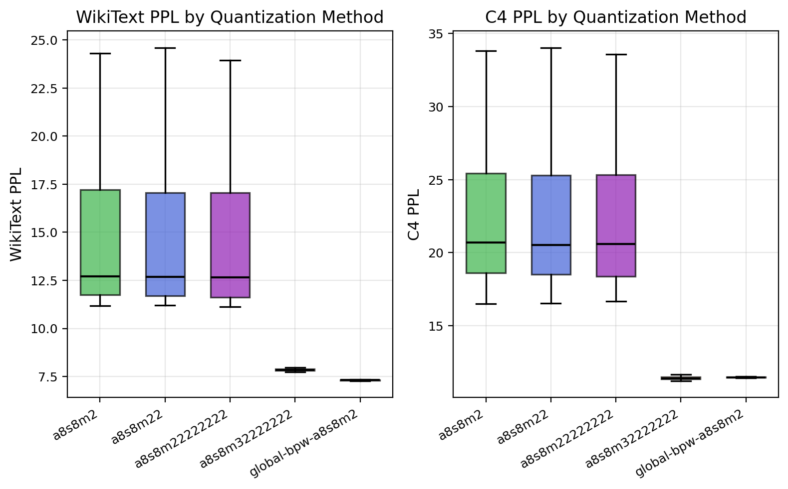

| Seed | Fixed scheme<br>(2slice) | | Fixed scheme<br>（8slices） | | Global DP scheme<br>(global-bpw-a8s8m2) | |
|------|-----------|----|----------|---------------|----|----|
| | WikiText2 | C4 | WikiText2 | C4 | WikiText2 | C4 |
| 0 | 24.297 | 33.808 | 23.944 | 33.586 | 7.332 | 11.441 |
| 42 | 11.761 | 16.495 | 11.620 | 16.665 | 7.282 | 11.461 |
| 84 | 13.471 | 22.129 | 13.319 | 22.085 | 7.353 | 11.472 |
| 126 | 15.611 | 23.108 | 15.648 | 23.039 | 7.301 | 11.418 |
| 168 | 21.978 | 32.428 | 21.296 | 32.163 | 7.316 | 11.449 |
| 210 | 11.719 | 18.977 | 11.612 | 18.716 | 7.316 | 11.481 |
| 252 | 11.957 | 19.228 | 11.971 | 19.062 | 7.335 | 11.524 |
| 294 | 11.169 | 17.529 | 11.121 | 17.327 | 7.303 | 11.438 |

## Visualization and Analysis


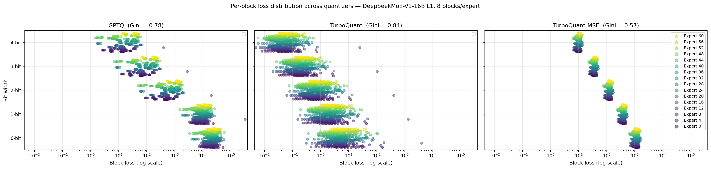
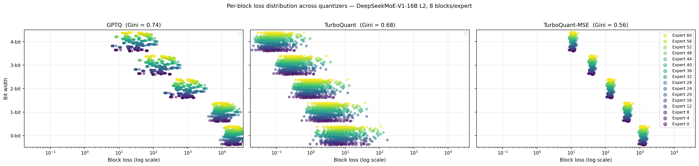
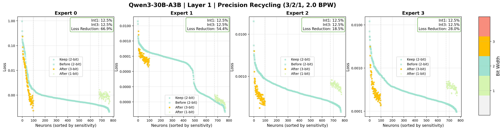

## Installation

### Prerequisites

```bash
conda env create -f environment.yml
conda activate dartmoq
```

### Requirements

- Python 3.8+
- PyTorch 2.0+
- CUDA 11.8+
- Transformers
- Datasets
- NumPy
- Matplotlib

## Usage

### Basic Command

```bash
python run_dartmoq.py \
    <model_path> \
    <dataset> \
    [--slices N] \
    [--nsamples N] \
    [--rank-mode MODE] \
    [--quant-scheme SCHEME] \
    [--quantmode {gptq,turboquant}] \
    [--eval-zero] \
    [--save-model]
```

### Arguments

| Argument | Description | Default |
|----------|-------------|---------|
| `model` | Path to HuggingFace model checkpoint | **Required** |
| `dataset` | Calibration dataset: `wikitext2`, `ptb`, or `c4` | **Required** |
| `--seed` | Random seed for calibration sampling | 42 |
| `--nsamples` | Number of calibration samples | 128 |
| `--slices` | Number of sub-experts to slice (S) | 1 |
| `--rank-mode` | Neuron ranking mode for expert reordering | None |
| `--quant-scheme` | Quantization scheme (fixed or global) | None |
| `--quantmode` | Quantization algorithm: `gptq` or `turboquant` | `turboquant` |
| `--eval-zero` | Enable zero-shot task evaluation | False |
| `--save-model` | Save quantized model to disk | False |
| `--standby-layer-cpu` | Move layers to CPU during quantization | False |
| `--no-use-hybrid-moe` | Disable hybrid MoE structure and use original experts | False (hybrid enabled by default) |
| `--disable-0bit-compensation` | Disable 0bit compensation (0bit weights incur quantization overhead) | False (0bit compensation enabled by default) |
| `--disable-0bit-prune` | Disable 0bit in DP search (only use 1-4 bits, no pruning) | False (0bit enabled by default) |

## Rank Modes (`--rank-mode`)

The rank mode determines how neurons are ordered within each expert for optimal quantization. Different modes are optimized for different quantization algorithms.

### Activation-Based Modes

| Mode | Description | Best For |
|------|-------------|----------|
| `expert_activation` | Rank neurons by activation frequency in input samples | Baseline comparison |
| `energy` | Rank neurons by energy contribution (from CAMERA, for comparison only) to output | Interpretability-focused, baseline comparison |
| `random` | Random neuron ordering for baseline testing | Baseline comparison |
| `neuron_index` | Original neuron index order | Baseline comparison |

### GPTQ-Specific Modes

| Mode | Description | Best For |
|------|-------------|----------|
| `gptq_quant_outlier` | Rank by GPTQ quantization loss, identifying error-sensitive neurons | **GPTQ quantization** |

### TurboQuant-Specific Modes

| Mode | Description | Best For |
|------|-------------|----------|
| `turboquant_innerproduct` | TurboQuant outlier analysis using inner product loss in activation space | **Recommended for TurboQuant** |
| `turboquant_mse` | TurboQuant with pure weight-space MSE (no activation weighting) | Not recommended - only for ablation/comparison |
| `turboquant_iipl` | TurboQuant with Input-Intermediate Product Loss (weight MSE weighted by intermediate activation second moment) | TurboQuant (alternative) |
| `turboquant_diagonal` | TurboQuant with diagonal Hessian approximation | Computationally constrained |
| `turboquant_hessian` | TurboQuant with full Hessian computation | Highest accuracy (slower) |
| `turboquant_qjl_sensitivity` | TurboQuant with quantized Johnson-Lindenstrauss sensitivity | Theoretical exploration |
| `turboquant_mse_fea` | TurboQuant pure MSE with full experts activation | Not recommended - only for ablation/comparison  |
| `turboquant_iipl_fea` | TurboQuant IIPL with full experts activation | Not recommended |
| `turboquant_innerproduct_fea` | TurboQuant inner product with full experts activation | Not recommended |

## Quantization Schemes (`--quant-scheme`)

The quant scheme determines how bits are allocated to neurons/blocks.

### Fixed Bit Schemes

Format: `a{A}s{S}m{BIT_STRING}`

- `A`: attention weights quantization bits
- `S`: shared expert quantization bits
- `BIT_STRING`: routed expert bit string: allocation for each slice (length must equal --slices)

Examples:
- `a8s8m22222222`: attention 8 bit quant, shared expert 8 bit quant, routed expert with all slices 2 bits (2.0 bpw excluding overhead)
- `a8s8m44332211`: attention 8 bit quant, shared expert 8 bit quant, routed expert with bits decrease from 4 to 1 (2.5 bpw average excluding overhead)
- `a8s4m3322`: attention 8 bit quant, shared expert 4 bit quant, routed expert with bits decrease from 3 to 2 (2.5 bpw average excluding overhead)
- `global-a8s4m3322`: attention 8 bit quant, shared expert 4 bit quant, routed expert with bits decrease from 3 to 2 (global 2.5 bpw average excluding overhead)

### Global Dynamic Programming Schemes

Format: `global-bpw-a{A}s{S}m{BPW}`

Uses the global DP optimizer with monotonic non-increasing bit allocation constraint across all experts.

- `A`: attention weights quantization bits
- `S`: shared expert quantization bits
- `BPW`: routed expert bit string: target average bits per weight (can be fractional)

**Important Note**: The bpw values in all schemes (both fixed and `global-bpw`) refer to the weight bit allocation only. They do **not** include the additional overhead of:
- GPTQ: ~0.25 bpw for quantization parameters
- TurboQuant: ~0.252 bpw for quantization parameters

All computations use a consistent groupsize of 128. The actual total bpw will be approximately `target_bpw + 0.25` (GPTQ) or `target_bpw + 0.252` (TurboQuant).

Examples:
- `global-bpw-a8s8m0.5`: attention 8 bit quant, shared expert 8 bit quant, routed expert with all slices 2 bits, global ~0.5 bpw target (excluding overhead)
- `bpw-a8s8m2.5`: attention 8 bit quant, shared expert 8 bit quant, routed expert with all slices 2 bits, ~2.5 bpw target inside one expert (excluding overhead)

### How Global DP Works

1. **Per-expert neuron sorting**: Neurons in each expert are sorted by sensitivity
2. **Global sub-expert sorting**: All sub-experts are globally sorted by importance (sensitivity × expert activation rate)
3. **Monotonic DP search**: Find optimal bit allocation with non-increasing bit constraint
4. **Remap to per-expert schemes**: Map global allocation back to each expert

### Global Ablation Experiments
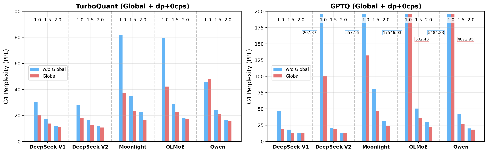

This figure compares **Left (TurboQuant)**: Blue = without Global, Red = Global configuration. The Global configuration significantly reduces PPL, especially at low bits (1.0bpw).
**Right (GPTQ)**: Same comparison for GPTQ quantization. Global consistently lowers PPL, with the most pronounced benefits at low bits. Overall, the Global configuration improves low-bit quantization performance for both TurboQuant and GPTQ methods because the global ranking allows important neurons (particularly those in frequently activated experts) to preserve information using higher bit widths. 

## 0bit Compensation

DartMoQP supports **0bit compensation** (enabled by default), which treats pruning (0bit) differently from quantization in the DP search:

- **0bit (pruned) weights**: Do not incur quantization overhead in the effective bit calculation
- **Non-zero bit weights**: Incur quantization overhead (typically ~0.25 bpw)

This means the DP search can more aggressively use 0bit for less important neurons without being penalized by the overhead cost, leading to better overall quality at the same effective bpw.

To disable 0bit compensation (treat 0bit the same as other bit widths), use:
```bash
--disable-0bit-compensation
```

### How 0bit Compensation Works

1. **Effective bit calculation**:
   - 0bit: `0.0` (no overhead)
   - 1bit: `1.25` (1 bit + 0.25 overhead)
   - 2bit: `2.25` (2 bits + 0.25 overhead)
   - ... and so on

2. **Target calculation**:
   - The input `target_bpw` is the raw bpw (no overhead)
   - The DP uses an effective target of `target_bpw + 0.25` (assuming all bits are non-zero)
   - During DP search, 0bit can be used to save overhead for unimportant neurons

3. **Performance optimization**:
   - Uses discretization with `search_scale_factor=20` (0.05 bit precision) for a good balance of speed and accuracy

## 0bit Pruning Control

DartMoQP supports **0bit pruning** (enabled by default), which allows the DP search to use 0bit (complete pruning) as an option for neuron allocation:

- **With 0bit enabled** (default): DP search uses bit set `{0, 1, 2, 3, 4}`
- **Without 0bit**: DP search uses bit set `{1, 2, 3, 4}` (only quantization, no pruning)

This is useful for ablation studies to understand the contribution of pruning vs. quantization in the unified framework.

To disable 0bit pruning (only use 1-4 bits for quantization), use:
```bash
--disable-0bit-prune
```

### Key Differences Between 0bit-Related Flags

| Flag | Bit Set Used | 0bit Overhead | Purpose |
|------|-------------|---------------|---------|
| Default | `{0, 1, 2, 3, 4}` | 0bit has no overhead | Full unified quantization + pruning (recommended) |
| `--disable-0bit-compensation` | `{0, 1, 2, 3, 4}` | 0bit = `0.25` overhead | Ablation: 0bit without overhead advantage |
| `--disable-0bit-prune` | `{1, 2, 3, 4}` | N/A (no 0bit) | Ablation: pure quantization without pruning |

## Quantization Modes (`--quantmode`)

### GPTQ (`gptq`)

- **Type**: Per-row quantization
- **Sensitivity metric**: Element-wise MSE
- **Best rank mode**: `gptq_quant_outlier`
- **Strengths**: Well-understood, good stability, mature implementation
- **Overhead**: ~0.25 bpw additional (groupsize=128)

### TurboQuant (`turboquant`)

- **Type**: Vector quantization with global random rotation
- **Sensitivity metric**: Inner product loss on calibration manifold
- **Best rank mode**: `turboquant_innerproduct` (recommended)
- **Strengths**: Better compression at extremely low bits, energy homogenization
- **Overhead**: ~0.252 bpw additional (groupsize=128)

## Recommended Combinations

### For 2-bit ManualDeployment

```bash
# TurboQuant version (recommended for best quality)
python run_dartmoq.py \
    $MODEL_PATH \
    wikitext2 \
    --slices 8 \
    --nsamples 64 \
    --rank-mode turboquant_innerproduct \
    --quant-scheme global-a8s8m32222221 \
    --quantmode turboquant \
    --eval-zero

# GPTQ version
python run_dartmoq.py \
    $MODEL_PATH \
    wikitext2 \
    --slices 8 \
    --nsamples 64 \
    --rank-mode gptq_quant_outlier \
    --quant-scheme a8s8m44222220 \
    --quantmode gptq \
    --eval-zero
```
`global-a8s8m32222221` is the quantization scheme closest to 2 + 0.25 bpw in paper Camera-Q.

### For Global Optimal Search (Any BPW)

```bash
# TurboQuant with global DP
python run_dartmoq.py \
    $MODEL_PATH \
    wikitext2 \
    --slices 8 \
    --nsamples 64 \
    --rank-mode turboquant_innerproduct \
    --quant-scheme global-bpw-a8s8m1.5 \
    --quantmode turboquant \
    --eval-zero

# GPTQ with global DP
python run_dartmoq.py \
    $MODEL_PATH \
    wikitext2 \
    --slices 8 \
    --nsamples 64 \
    --rank-mode gptq_quant_outlier \
    --quant-scheme global-bpw-a8s8m1.5 \
    --quantmode gptq \
    --eval-zero
```

### For BPW Sweep

See `run.sh` for examples of sweeping across bpw values from 0.5 to 4.0.

## Supported Models

- `DeepSeek-MoE-16B` (16B-A3B)
- `DeepSeek-V2-Lite` (16B-A3B)
- `OLMoE-1B-7B` (7B-A1B)
- `Moonlight-16B-A3B`
- `Qwen3-30B-A3B`
- Most other MoE architectures with expert FFNs

## Calibration Datasets

- `wikitext2`: Wikitext-2 (recommended for most use cases)
- `c4`: C4 (Colossal Clean Crawled Corpus)
- `ptb`: Penn Treebank

64-128 samples are typically sufficient for good calibration.

## Output Files

- Intermediate results: `intermediate_result/`
  - Quantization cache: `intermediate_result/quant_outlier_{gptq,turboquant}/{rank_mode}/{model_id}/`
  - Expert activation cache: `intermediate_result/expert_activate/{model_id}/`
- Visualizations: `plot/`
- Saved models: `models/dartmoq_{model_type}_{rank_mode}_{quant_scheme}/`

## Visualization Tools

DartMoQP includes visualization modules in the `viz/` directory:

```bash
# Headroom analysis
python -m viz.headroom

# Metric geometry analysis
python -m viz.metric_geometry

# Loss distribution plots
python -m viz.distribution

# Activation rate analysis
python -m viz.dump_activation_rates
```

## Log Parser

DartMoQP provides a log parser to parse Slurm log files into aligned benchmark rows.

```bash
# Basic usage - plain text output to stdout
python logs_parser.py slurm-*.out

# CSV output (writes to <logfile>.csv)
python logs_parser.py --format csv slurm-*.out

# JSON output (writes to <logfile>.json)
python logs_parser.py --format json slurm-*.out

# Markdown table output (writes to <logfile>.md)
python logs_parser.py --format md slurm-*.out

# Only include complete runs (filter out failed/partial)
python logs_parser.py --complete-only slurm-*.out
```

The parser extracts:
- Model configuration (model path, slices, quant scheme, rank mode, quant mode, bpw)
- Perplexity results (WikiText2, C4)
- Zero-shot task metrics (ARC-Challenge, ARC-Easy, PIQA, BoolQ, Winogrande, MNLI, Hellaswag, MMLU)
- Runtime information
- Error status and messages
- The parser handles incomplete/crashed runs gracefully by leaving missing metrics empty instead of misaligning columns.

## Dense Model Quantization Support

DartMoQP is specifically designed for **Mixture-of-Experts (MoE) models** and does not support dense (non-MoE) models. For mixed-precision quantization of dense models, please refer to our dedicated method:

[DartMQ](https://github.com/zzningxp/DartMQ) — A unified framework for mixed-precision quantization of dense transformer models.

## Citation

If you use DartMoQP in your research, please cite:

```bibtex
@article{dartmoqp2024,
  title={DartMoQP: A MoE-Native Unified Framework for Mixed-Precision Quantization and Structured Pruning},
  author={Zhaoning Zhang},
  year={2026}
}
```

## License

This project is released under the same license as the base models it quantizes. Please refer to the original model licenses for details.

## Acknowledgments

- GPTQ for the per-row quantization baseline
- TurboQuant for the vector quantization approach
- CAMERA (http://arxiv.org/abs/2508.02322) for energy-based importance estimation (for comparison only)
- ExLlamaV3 (https://github.com/turboderp-org/exllamav3)
- All the MoE model authors for their open-source contributions

